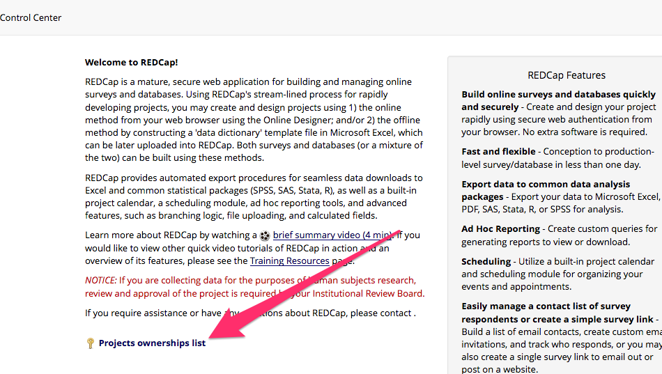
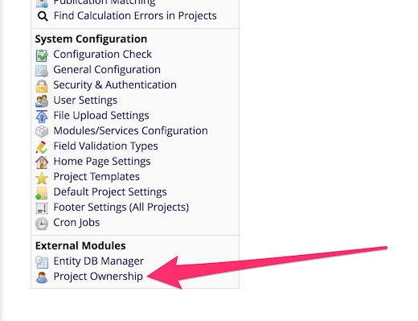
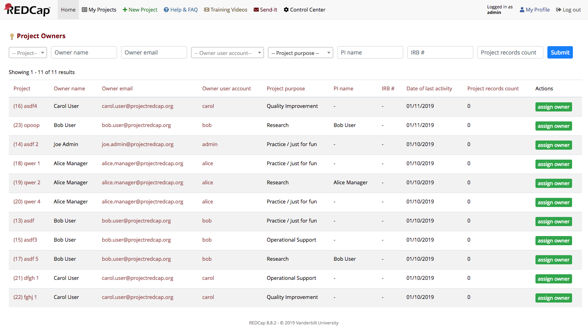

# REDCap Project Ownership

A REDCap module to aid in the collection and management of project ownership details. This module collects project ownership data at project creation, requires PI contact details on research projects, and provides interfaces to search, display and edit ownership details.

## Prerequisites

- REDCap >= 8.7.0
- [redcap_entity](https://github.com/ctsit/redcap_entity) >= 2.3.8

## Easy Installation
REDCap Project Ownership is available in the [REDCap Repo](https://redcap.vanderbilt.edu/consortium/modules/index.php).  To install it follow these steps:

- Access your REDCap installation's _View modules available in the REDCap repo_ button at **Control Center > External Modules** to download _Project Ownership_. If it is not already installed on your REDCap system, you will also need to install the `redcap_entity` module.
- Once downloaded, enable Project Ownership and REDCap Entity if it is also needed. Each module will be enabled globally.

## Manual Installation
- Clone this repo into `<redcap-root>/modules/project_ownership_v0.0.0`.
- Clone [redcap_entity](https://github.com/ctsit/redcap_entity) repo into `<redcap-root>/modules/redcap_entity_v0.0.0`.
- Go to **Control Center > External Modules** to enable Project Ownership and REDCap Entity. Each module will be enabled globally.

## Collecting project ownership
The project ownership details are collected on project creation page. Three fields are required: first name, last name and email. Alternatively, the user can set a REDCap username, so the required information is pulled from that user account.

### Ownership auto assign
Users may click on "I am the owner" link to auto-assign the ownership.

### Autocomplete from PI information
If the purpose of the project is "Research", the ownership fields are auto-completed as the PI information is filled out.

### Autocomplete PI information
The PI information can also be automatically filled in when the "I am the owner" link to auto-assign the ownership is clicked.

## Checking and updating project ownership
The same fieldset from project creation page may be seen at project settings modal - where users are able to check and update ownership information.

## Projects ownership list
A list of project ownership is accessible to users at __My Projects__ page.

It is accessible to admins as a link in the Control Center.

On this list, you have a view to the ownership of projects you have access to. From each row you may access links to update ownership information or access the project home page.

The Project Ownership List is accessible via the custom action, _project\_ownership_. E.g., the ownership list can be referenced like this example: [https://redcap.example.org/index.php?action=project_ownership](https://redcap.example.org/index.php?action=project_ownership) This is useful if you need a static link to the Project Ownership List. The action has the added benefit of being a _shorter_ URL.

## Backfilling project ownership

This module forces the collection of project ownership information, but it cannot address a long history of missing ownership info.  If some guess as to the ownership is needed, that can be addressed with heuristics that guess at ownership info from the REDCap database.  University of Florida's CTS-IT did this for UF's primary REDCap environment.  The product of that work is available in the form of two SQL files [backfill\_project\_ownership\_test.sql](doc/backfill_project_ownership_test.sql) and [backfill\_project\_ownership.sql](doc/backfill_project_ownership.sql) These files gleen ownership data from the REDCap database using 16 queries of PI, creator, user-authorization, user activity and login data. They produce a reasonable guess of who is likely to care about the data in a project and be available to speak with authority about that data. These files are somewhat specific to UF and would need to be adapted to local requirements before use at other institutions. Specifically, the records in the paid_creators table and some individual project records would have no meaning outside of UF.

## System Level Configuration

- "Additional Text Toggle": Toggle showing of "Additional Project Ownership Text"
- "Additional Project Ownership Text": A configurable rich-text field that will be displayed at the end of the Project Ownership portion of the Project Settings menu when creating or modifying a project.
- "Enable features intended for use at the University of Florida": Enables features intended for use on UF CTSI-IT REDCap instances which are likely not useful for other institutions.

## Upgrades

REDCap entity does not have a facility to upgrade the schema of its tables. As such, any such changes have to be applied manually at module upgrade. These versions of project_ownership introduce schema changes:

### 2.1.0

Adds two columns to support UF-specific billing workflows. Run the SQL file [schema/2.1.0/upgrade.sql](./schema/2.1.0/upgrade.sql) if you want these changes.
