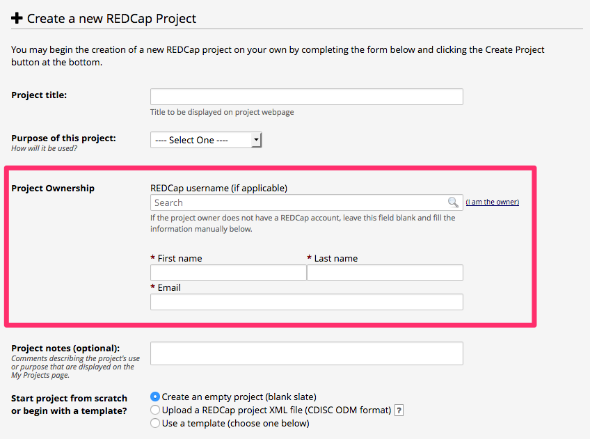
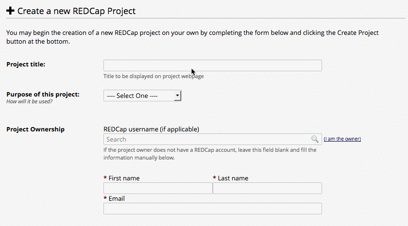
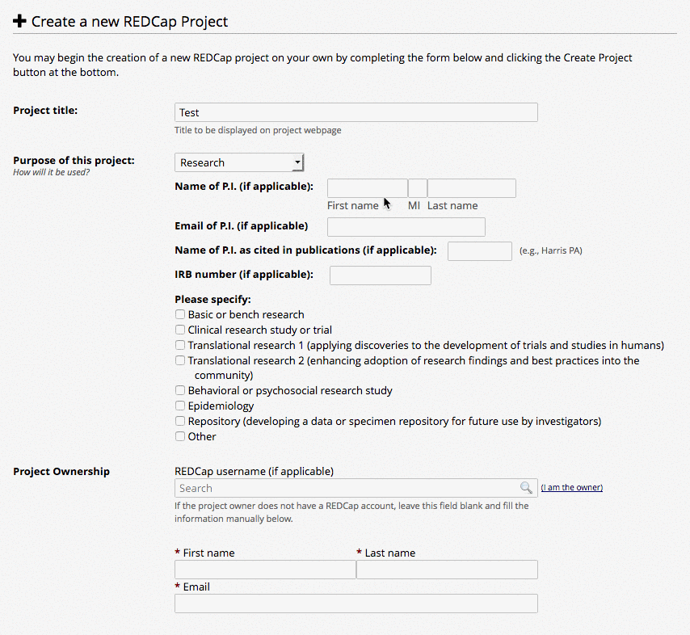
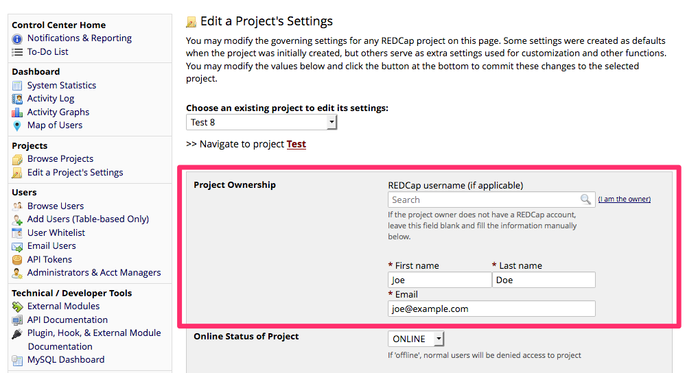

# REDCap Project Ownership
A REDCap module to enforce the collection of ownership details at project creation.

## Prerequisites
- REDCap >= 8.0.3

## Installation
- Clone this repo into `<redcap-root>/modules/project_ownership_v<version_number>`.
- Go to **Control Center > Manage External Modules** and enable Project Ownership.

## Collecting project ownership
The project ownership is collected on project creation page. 3 fields are required: first name, last name and email. Alternatively, the user can set a REDCap username, so the required information is pulled from its user account.

### Ownership auto assign
Users may click on "I am the owner" link to auto-assign the ownership.

### Autocomplete from PI information
If the purpose of the project is "Research", the ownership fields are auto completed as the PI information is filled out.

## Checking and updating project ownership
The same fieldset from project creation page may be seen at project settings modal - where users are able to check and update ownership information.

## Backfilling project ownership

This module forces the collection of project ownership information, but it cannot address a long history of missing ownership info.  If some guess as to the ownership is needed, that can be addressed with heuristics that guess at ownership info from the REDCap database.  University of Florida's CTS-IT did this for UF's primary REDCap environment.  The product of that work is available in the form of two SQL files [backfill_project_ownership_test.sql](doc/backfill_project_ownership_test.sql) and [backfill_project_ownership.sql](doc/backfill_project_ownership.sql) These files gleen ownership data from the REDCap database using 16 queries of PI, creator, user-authorization, user activity and login data. They produce a reasonable guess of who is likely to care about the data in a project and be available to speak with authority about that data. These files are somewhat specific to UF and would need to be adapted to local requirements before use at other institutions. Specifically, the records in the paid_creators table and some individual project records would have no meaning outside of UF.
